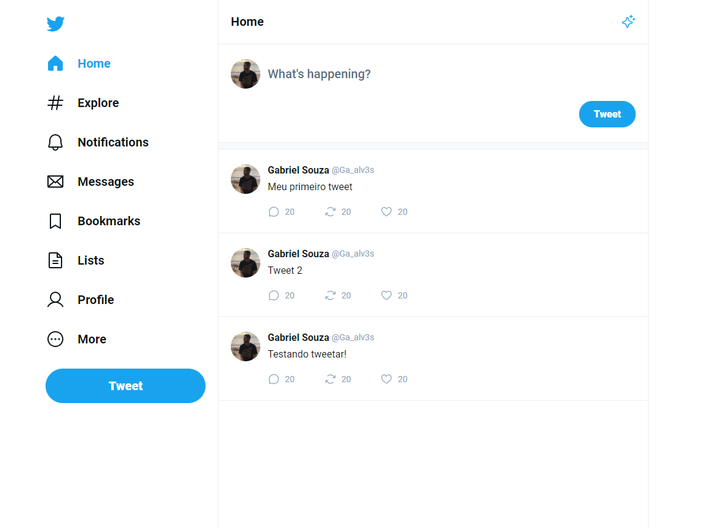

<h1 align="center">
  Twitter UI
</h1>

## Preview
[Twitter-UI](https://twitter-ui-nu.vercel.app/)

  

  <a href="#-tecnologias">Tecnologias</a>&nbsp;&nbsp;&nbsp;|&nbsp;&nbsp;&nbsp;
  <a href="#-projeto">Projeto</a>&nbsp;&nbsp;&nbsp;|&nbsp;&nbsp;&nbsp;
  <a href="#memo-licença">Licença</a>

 

## 🚀 Tecnologias

Esse projeto foi desenvolvido em React, com o intuito de reforçar os conhecimentos básicos sobre essa tecnologia.

 
 

### Feito por Gabriel Alves
